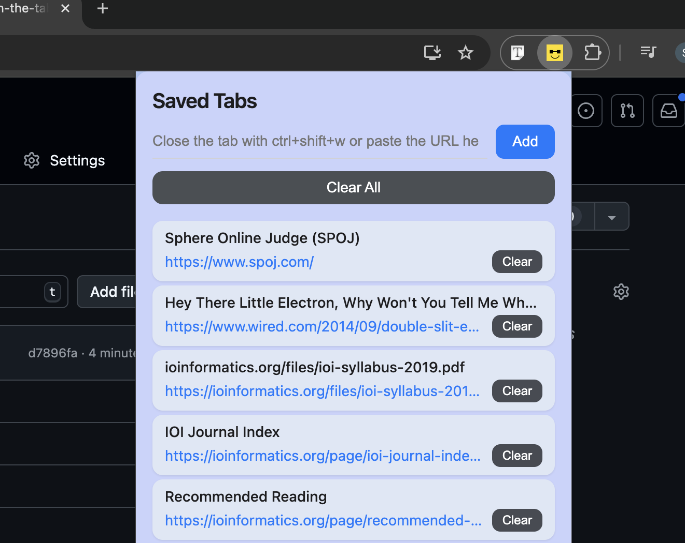

# Munch the Tabs Killer: A Web Extension

## Overview
When you have too many tabs open that are:
- Too important to close
- Not significant enough to bookmark
- Creating clutter that slows your system
- Living for days or weeks in a state of indecision

This extension allows you to quickly save a tab's URL and close it with `Alt+Shift+W` (Windows/Linux) or `MacCtrl+Shift+W` (⌃⇧W) (Mac), keeping your browser clean and organized.

## Features
- Save any tab's URL with a single keyboard shortcut
- Automatically close the tab after saving
- Access your saved URLs anytime through the extension
- Lightweight with minimal performance impact

## Installation

### Chrome/Edge/Brave
1. Download or clone this repository
2. Open your browser and navigate to `chrome://extensions/`
3. Enable "Developer mode" (toggle in the top-right corner)
4. Click "Load unpacked" and select the extension directory
5. The extension should now appear in your toolbar

### Firefox
1. Download or clone this repository
2. Open Firefox and navigate to `about:debugging#/runtime/this-firefox`
3. Click "Load Temporary Add-on"
4. Navigate to the extension directory and select any file (e.g., manifest.json)
5. The extension will be installed temporarily (will be removed when Firefox is closed)

## Usage
1. When you have a tab you want to save but close:
   - Press `Alt+Shift+W` (Windows/Linux) or `MacCtrl+Shift+W` (⌃⇧W) (Mac)
   - The tab will be saved and closed automatically
2. To access your saved tabs:
   - Click on the extension icon in your browser toolbar
   - View and manage your saved tabs in the popup

## Contributing
Feel free to submit issues or pull requests.

## License
[MIT License](LICENSE)
